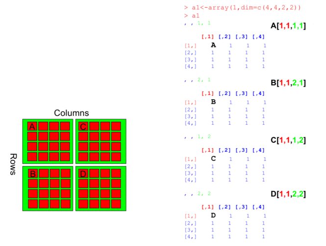
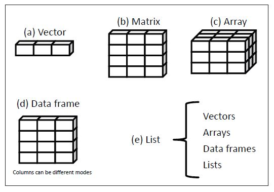

# Conceitos Essenciais
### Tipos de dados:
**Lógico**: TRUE; FALSE  
**Inteiro**: 1; 10; 1000  
**Caractere**: Um; dez; mil  
**Numérico**: 1,249; 26,5  

### Armazenamento de dados
Os objetos são métodos de armazenar os dados, sendo que cada tipo de objeto pode aceitar apenas um ou mais tipo de dados. Os objetos podem ser Vetores, Dataframes, Matrizes, Arrays ou Listas.

# Vetores
São o tipo mais simples de armazenar dados, colocando-os em sequeência. A função c() - que significa combinar/concatenar - é usada para criar um vetor.

### Criando e manipulando vetores numéricos
```{r eval=FALSE}
x<- c(1,3,5,7,9)
x
```
Operações são aplicadas a cada elemento do vetor.

```{r eval=FALSE}
x^2
```

Podem ser acessado e modificados usando a notação [].

```{r eval=FALSE}
x[2]

x[2]<-10
x

z<- c(5,6,7,8,9,10)
z

z[1:3]

z[1:3]<-c(0,0,NA)
```
É possível adicionar elementos a um vetor.
```{r eval=FALSE}
z<- c(z, 11)
```
Ou remover elementos.
```{r eval=FALSE}
z<- z[-c(1,2,3)]
```
Também é possível criar sequências.
```{r eval=FALSE}
seq(1,5,0.5)
```
### Criando e manipulando vetores de caracteres
```{r eval=FALSE}
letras<- c("a", "A", "b, "B, "c", "j", "Z")
palavras<- c("Manaus", "Boa Vista", "Belém", "Brasília")
```
Acessar um item ou ver tamanho do vetor:
```{r eval=FALSE}
letras[4]
length(palavras)
```
Para atualizar um item do vetor basta acessá-lo e atribuir um novo valor.
```{r eval=FALSE}
letras[6]<-"Y"
```
### Nome de vetores
```{r eval=FALSE}
names(palavras)<-c("Pedro", "Paulo", "Ana", "Maria")
palavras["Ana"]
```
### Plots
Plotar notas de alunos em um gráfico de barras:
```{r eval=FALSE}
notas<-c(7,9,6,10)
barplot(notas)
names(notas)<- c("Pedro", "Paulo", "Ana", "Maria")
barplot(notas)
```
Gráfico de dispersão:
```{r eval=FALSE}
x<-seq(1,20,0.1)
y<-sin(x)
plot(x,y)
```
### Valores NA
NA indica ausência de valores, o que pode atrapalhar o funcionamento das funções.  
Veja o que ocorre quando uma função de soma é aplicada a um vetor contendo NA.
```{r eval=FALSE}
a<-c(1,3,NA,7,9)
sum(a)
```
Para retirar esta interferência, o parâmetro na.rm é bastante útil.
```{r eval=FALSE}
sum(a, na.rm=TRUE)
```
# Matrizes
Múltiplas colunas de vetores com o mesmo tipo de dado (numérico ou caractere), formando uma tabela:
```{r eval=FALSE}
a<-1:10
b<-21:30
c<-81:90
d<-matrix(c(a,b,c), ncol=3)
```
Todas as colunas de uma matriz devem ter a mesma quantidade de linhas para serem aceitas.  
É possível extrair dados da matriz com a conotação []: NomeDaMatriz[#linha,#coluna].
```{r eval=FALSE}
d[8,2]
d[2,3]
d[2:3, ]
d[1,]<-NA
```
Dimensão de uma matriz
```{r eval=FALSE}
dim(d)
nrow(d)
ncol(d)
```
### Gráficos com matrizes
```{r eval=FALSE}
mt <- matrix(1, 10, 10)
mt[4, 6] <- 0
image(mt)
contour(mt)
persp(mt, expand=0.2)
```
Uso de uma matriz do pacote RColorBrewer (o pacote deve estar instalado)
```{r eval=FALSE}
library("RColorBrewer")
dim(volcano)
contour(volcano)
persp(volcano, expand=0.2)
mypalette<-colorRampPalette(c("blue","yellow","red"))
image(volcano, col = mypalette)
```
Cores
```{r eval=FALSE}
mypalette<-brewer.pal(7,"Greens")
mypalette<-brewer.pal(7,"Reds")
mypal<-colorRampPalette(mypalette)(100)
```
# Dataframes
Bastante semelhantes à matriz, mas aceita vetores de tipos diferentes.
```{r eval=FALSE}
a<-1:10
b<-letters[1:10]
c<-month.name[1:10]
d<-data.frame(a,b,c)
colnames(d)
colnames(d)<-c("ColA", "ColB", "ColC")
```
A notação $ pode ser usada para acessar as colunas, se elas estiverem nomeadas.
```{r eval=FALSE}
d$ColA
d[["ColA"]]
```
O subset em dataframes funciona a mesma maneira que matrizes, com NomeDoDataframe[#linha,#coluna].   
  
Ex: Pegar as 5 primeiras linhas de cada coluna
```{r eval=FALSE}
d[1:5,]
```
OBS: Transforme o dataframe em uma matriz e veja o que acontece.
```{r eval=FALSE}
e<-as.matrix(d)
```
### Salvar dataframes
```{r eval=FALSE}
write.table(d, file="tabela.csv", quote=FALSE, sep=",", row.names=TRUE)
write.csv(d, file="tabela.csv", row.names=FALSE)
list.files()
```
### Ler/carregar dataframes
```{r eval=FALSE}
dados1 <- read.table(file = "tabela.txt", sep="@")
dados2 <- read.csv(file = "tabela.csv")
```
# Arrays
Correspondem a tabelas com múltiplas dimensões. Por exemplo, criar um array com as dimensões (4,4,2,2) significa criar duas colunas contendo, cada uma, 2 tabelas com as dimensões de 4 linhas e 4 colunas cada tabela.


<legend>Figura 1 - Estrutura física do array</legend>

Para criar um array, utiliza-se a função array().
```{r eval=FALSE}
al<-array(1,dim=c(4,4,2,2))
```

# Listas
Armazenam coleções de qualquer objeto ou tipo de dado aceito pelo R. Ex: É possível armazenar um vetor, uma matriz e um data frame no mesmo objeto.
```{r eval=FALSE}
a<-1:10
b<-matrix(runif(100), ncol=10, nrow=10)
c<-data.frame(ColA=a, Meses=month.name[1:10])

my_list<-list(obj1=a, obj2=b, obj3=c)
```
Notação $ pode ser usada para resgatar itens da lista.
```{r eval=FALSE}
my_list$obj1
```
Para visualizar o primeiro slot da lista:
```{r eval=FALSE}
my_list[1]
```
Para acessar o conteúdo do primeiro slot:
```{r eval=FALSE}
my_list[[1]]
```
Pegar o segundo item do primeiro slot da lista:
```{r eval=FALSE}
my_list[[1]][2]
```
#Resumindo...

<legend>Figura 2 - Diferenças estruturais dos objetos</legend>

# Funções
Apesar de serem aplicadas nos objetos citados acima, as funções também podem ser consideradas objetos do R. Além das funções que já utilizamos até agora, há muitas outras criadas para fazer os mais diversos tipos de cálculos.

### Funções de sumarização
Vetor nomeado com o número de pernas e braços na tripulação de um barco:
```{r eval=FALSE}
per_bra<-c(4,3,4,3,2,4,4,4,14)
names(per_bra)<- c("Caolho", "Perneta", "Silva", "Capitão", "Zé1", "Zé2", "Zé3", "Bnigra", "DJones")
```
Média
```{r eval=FALSE}
mean(per_bra)
barplot(per_bra, xlab="Tripulantes",ylab="Pernas e bracos",cex.names=0.7)
abline(h = mean(per_bra), col="red",lw=2)
```
Desvio Padrão
```{r eval=FALSE}
sd(per_bra)
abline(h = mean(per_bra)+sd(per_bra), col="blue",lw=2)
abline(h = mean(per_bra)-sd(per_bra), col="blue",lw=2)
```
Mediana
```{r eval=FALSE}
median(per_bra)
```
### Criando suas pŕoprias funções
Estrutura mínima
```{r eval=FALSE}
myfun1<-function(){
  print("Olá! Esta é a minha primeira função")
}
myfun1()
```
Recebendo argumentos
```{r eval=FALSE}
myfun2<-function(x,y){
  x+y
}
myfun2(2,2)
```
Um arquivo contendo suas funções pode ser carregado no ambiente de trabalho usando:
```{r eval=FALSE}
source("minhasFunções.R")
```
# Lições Interativas
Vamos continuar com as atividades no swirl.  
Se você ainda não tem o pacote swirl carregado no teu ambiente, volte na vignette("Intro"), na sessão de Lições Interativas para ver como fazer este passo.  
Para fazer a próxima lição, basta chamar a função novamente
```{r eval=FALSE}
#Começa o curso
swirl()
```
Dentro do curso **Programação em R**, Selecione a **lição "Subconjunto de Vetores"**. Quando terminar, pode se aventurar na **lição "Matrizes e Data Frames"**.
