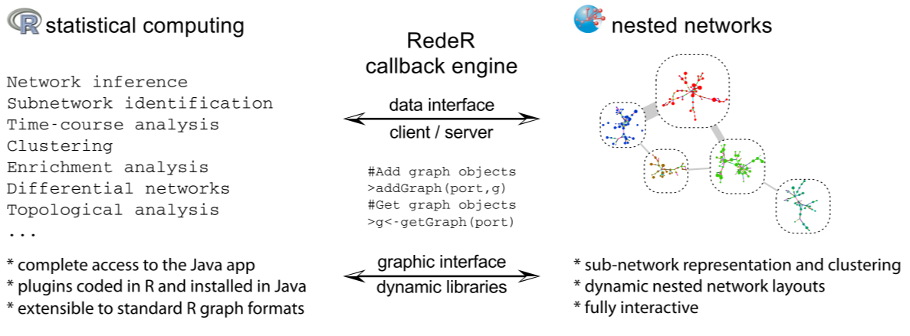
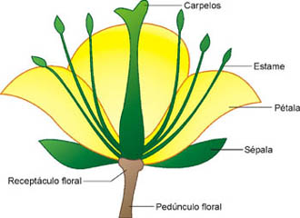

# Introdução
Plots podem ser feitos de várias maneiras em linguagem R, uma das funções mais utilizadas é o plot, que compreende uma família de funções genéricas presentes no núcleo do R, ou seja, vêm junto do R sem necessitar a instalação de um pacote específico. Dependendo do que se deseja, outras funções para plotar podem ser utilizadas, tornando possível a montagem de grafos diversos, como de pontos (scatter), regressão linear, de barras, histogramas, boxplots, etc.
O RedeR é um pacote baseado em R combinado com aplicação Java para visualização e manipulação dinâmica de redes. O pacote tira vantagem do R para realizar análises estatísticas robustas, enquanto que a interface de R para Java interliga a lacuna existente entre análise de redes e visualização. Ele foi feito para lidar com três desafios principais em análise de redes. Primeiramente, redes biológicas são modulares e hierárquicas, então a visualização precisa fazer uso de tais características. Em segundo, a análise de redes depende de métodos estatísticos, dos quais muitos já estão disponíveis em repositórios como CRAN ou Bioconductor. No entanto, o gap entre visualização avançada e computação estatística torna difícil o completo aproveitamento dos pacotes R para análise de redes. Em terceiro lugar, redes muito grandes tendem a precisarem de input de dados fornecidos pelo usuário a fim de focar a construção da rede para o que é biologicamente relevante, não sendo possível confiar em funções automáticas de layout.
RedeR é construído de modo a superar tais dificuldades.  


<legend>Figura 1 - Representação esquemática das chamadas do RedeR. Na interface de baixo nível, o webserver Apache xmlrpc é utilizado para conectar o R ao Java. </legend>

##Iniciando com plots
Quando se trabalha com uma grande quantidade de dados, a representação destes em forma dde grafos é extremamente necessária a fim de obter os insights que só podem ser vistos por abordagens mais abrangentes.  
Para exemplificar o uso de plots para dados biológicos, vamos carregar e visualizar um dataset jś presente no R, o iris.
```{r eval=FALSE}
data("iris")
View(iris)
```
Iris contém os dados de comprimento e largura da sépala e da pétala de 150 plantas de 3 espécies diferentes (Iris setosa, versicolor e virginica).


<legend>Figura 2 - Representação da estrutura de uma flor. A sépala é a região da flor que fornece sustentação às pétalas. </legend>

###Scatter Plot
Para plotar um grafo de pontos (scatter plot) da relação entre o comprimento e a largura das pétalas, basta utilizar a função plot.
```{r eval=FALSE}
plot(iris$Petal.Length, iris$Petal.Width, main= "Pétala - largura vs comprimento")
```
Para saber qual medida vem de qual espécie e se estas se agrupam, podemos alterar o tipo de ponto para cada espécie ou a cor destes.  
Alterando tipos de pontos do scatter plot:
```{r eval=FALSE}
plot(iris$Petal.Length, iris$Petal.Width, pch=c(21,22,23)[unclass(iris$Species)], main= "Pétala - largura vs comprimento")
```
Alterando cor
```{r eval=FALSE}
plot(iris$Petal.Length, iris$Petal.Width, pch=21, bg=c("red","green3","blue")[unclass(iris$Species)], main="Pétala - largura vs comprimento")
legend("bottomright", legend= levels(iris$Species), col=c("red","green3","blue"), pch=21, bty="n")
abline(lm(Petal.Width~Petal.Length, data=iris), col="grey")
```
Para ver como que as variáveis se comportam entre si de uma maneira mais gráfica, é possível criar um scatter plot de pares, que mostra a disposição dos pontos conforme cada combinação de dois fatores (Draftsman's design).
```{r eval=FALSE}
pairs(iris[1:4], main = "Relação par a par", pch = 21, bg = c("red", "green3", "blue")[unclass(iris$Species)])
```
###Histograma
Para ver se os dados seguem uma distribuição normal, o histograma é de grande utilidade:
```{r eval=FALSE}
hist(iris$Sepal.Width, col="grey")
hist(iris$Petal.Length, col="grey")
```

###Boxplot
Boxplot pode ser utilizado para comparar as diferenças entre as três espécies, por exemplo, como a largura da pétala.
```{r eval=FALSE}
boxplot(iris$Petal.Width~iris$Species, iris$Species, col=c("pink", "yellow", "grey"), ylab="Largura da pétala")
```

###Heatmaps
Torna visível a clusterização das espécies conforme determinadas características.
```{r eval=FALSE}
heatmap(t(iris[, 1:4]), trace="none", scale="row", key=TRUE, mar=c(2, 8), cexRow=1, ColSideColors=c("grey", "black", "yellow")[iris$Species])
```

###Volcano
O exemplo utiliza dados topográficos reais de um vulcão, mas pode ser usado para outros tipos de dados.  
Com dados topográficos:
```{r eval=FALSE}
filled.contour(volcano, color.palette = terrain.colors, asp = 1)
```

###Diagrama de Venn
```{r eval=FALSE}
library(gplots)
Setosa<-iris[iris$Species=="setosa",1]
Versicolor<-iris[iris$Species=="versicolor", 1]
Virginica<-iris[iris$Species=="virginica",1]
Sepala<-list(Setosa, Versicolor, Virginica)
names(Sepala) <- c("Setosa", "Versicolor", "Virginica")
venn(Sepala)
```

##Utilizando o RedeR
RedeR é uma ferramenta para construção e visualização de redes com integração à interface java.
###Principais chamadas
O primeiro passo é construir a porta do servidor, que será necessária em todos os procedimentos de chamada. O construtor RedPort é o padrão.
```{r eval=FALSE}
library(RedeR)
rdp <- RedPort()
```
Em seguida, o RedeR pode ser invocado utilizando o método calld:
```{r eval=FALSE}
calld(rdp)
```
Uma vez dentro da interface ativa, o método addGraph pode facilmente mandar grafos em R para a aplicação. Por exemplo, o trecho a seguir adiciona um objeto igraph[3].
```{r eval=FALSE}
library(igraph)
g1 <- graph.lattice(c(5,5,5))
addGraph( rdp, g1, layout.kamada.kawai(g1) )
```
É possível limpar a interface Java sem fechá-la:
```{r eval=FALSE}
resetd(rdp)
```
Gráficos R presentes na interface Java podem ser convertidos em objetos igraph com a função getgraph.

###Exemplo
Vamos supor que temos 3 camadas de dados populacionais (IDH, IMC e exportação) e queremos visualizar tudo de uma maneira simples.  
Primeiramente, carregue os as informações de IDH, IMC e de relações de comercialização do produto X:
```{r eval=FALSE}
data("dados")
data("edges")
```
Transforme a tabela em um objeto ighraph e atribua a média do IMC de cada país ao tamanho dos nodos e o nível do IDH para a cor dos nodos:
```{r eval=FALSE}
gr_total<-graph_from_data_frame(edges, directed = T, vertices = dados)
gr_total<- att.setv(g=gr_total, from="media_IMC", to="nodeSize", nquant=10, isrev=F, xlim=c(5,40,1))
gr_total<- att.setv(g=gr_total, from="IDH_level", to="nodeColor", pal=2)
```
Adicione o grafo à interface Java:
```{r eval=FALSE}
addGraph(rdp, gr_total, isNest =TRUE, gcoord=c(25,25), gscale=110, theme= 'tm1', zoom=100)
relax(rdp)
```
Adicione legenda das cores e dos tamanhos dos nodos
```{r eval=FALSE}
leg_cor <- gr_total$legNodeColor$scale
addLegend.color(rdp, colvec=leg_cor, labvec=c("Baixo (1)", "Médio (2)", "Alto (3)"), title="Nível do IDH")

leg_tam <- gr_total$legNodeSize$scale
leg <- gr_total$legNodeSize$legend
addLegend.size(rdp, sizevec=leg_tam, labvec=leg, title="IMC médio populacional")
```
# Lições Interativas
Quer colocar as novas habilidades em gráficos em prática? Volte ao swirl para treinar.  
Se você ainda não tem o pacote swirl carregado no teu ambiente, veja a sessão de Lições Interativas na vignette("Intro") para ver como fazer este passo.  
Para fazer a próxima lição, basta chamar a função novamente
```{r eval=FALSE}
#Começa o curso
swirl()
```
**Selecione a lição "Graficos Basicos" dentro do curso Programacao em R.**
